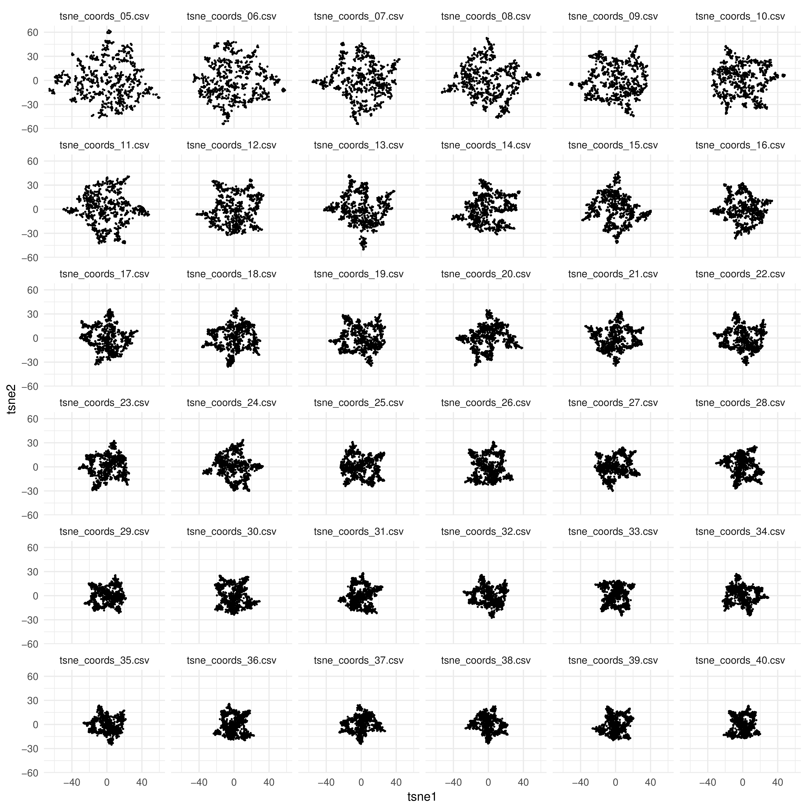

# tSNE Sweep with Slurm

This simple utility is designed to parallelize computation of tSNE embeddings at varying perplexities on a computer cluster managed by Slurm.
Results are combined and visualized in a facet plot to rapidly evaluate how changing the perplexity parameter modules outcome. 
All tSNE embedding tables are saved to the results directory.

To run, point the submit.sh script to your datafile and a save directory.
The data file should be saved as a flat csv file without rownames and headers (see example data file).

```bash
sbatch submit.sh etc/sample_data.csv results_dir
```

The output should look something like this:



